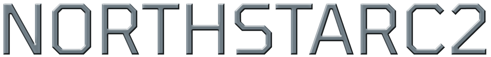

# 

 
NorthStarC2 is an open-source command and control framework developed for penetration testing and red teaming purposes by [Engin Demirbilek](https://www.linkedin.com/in/engin-d-742752153/), a senior majoring in Computer Engineering at Ankara University Faculty of Engineering. 
 
 
NorthStar C2 Framework consists of two applications, a server-side GUI web application for managing sessions and a client-side stager to communicate with C2 server.

# Quick Installation

 `git clone https://github.com/EnginDemirbilek/NorthStarC2.git`
 
 `cd NorthStarC2/`
 
`chmod +x install.sh`
 
 `sudo ./install.sh`

In order to install the NorthStar C2 properly and get the best experience possible, please refer to [Wiki page](https://github.com/EnginDemirbilek/NorthStarC2/wiki)

# NorthStarC2 Features

This project is being maintained and updated constantly so make sure to check back for new features and modules! See
[Roadmap](https://github.com/EnginDemirbilek/NorthStarC2/wiki/Roadmap).

Languages ​​and technologies used in the NorthStar C2:
 
Client-Side: C # .NET
 
Server-Side: PHP, JS, HTML, CSS

Currently, the client-side application (NorthStar Stager) has the following functions:

- Connecting to the C2 Server via HTTP or HTTPS,
- Receiving commands from the server-side application and responding to the command via HTTP methods,
- Encrypting the communication traffic with XOR and obfuscating it with Base64,
- Copying itself to a different directory,
- Persistance through start-up folders and schtasks,
- Host Reconnaissance : Hostname, Username, Current Privileges, Exec Dir and Process ID,
- Privilege Escalation : UAC bypass through eventvwr.exe,
- Taking screenshots and saving them into a directory,
- Uploading any file to the victim machine,
- Downloading any file from the victim machine,
- SAM dump via reg save command,
- Changing the working directory,
- View the files and folders in the directory,
- Viewing the contents of the files,
- Deleting files,
- Send commands directly on cmd.exe.

Currently, server-side application has the following functions:

- User-Friendly GUI with everything needed to manage sessions opened by the stager.

## Contributors
During the development process these guys spent hours on this project:
 
[Selçuk Demir](https://github.com/s3lcuk) and [Hasan Ekin Dumanoğulları](https://www.linkedin.com/in/hekindmn/).

# GUI Preview

 
 
 

 
 
 

# Acknowledgements

[Prof. DR. Refik SAMET](http://cv.ankara.edu.tr/samet@eng.ankara.edu.tr)

For theme : [RuangAdmin](https://github.com/indrijunanda/RuangAdmin)

For most of the source code : [StackOverflow](https://stackoverflow.com/)

For inspiration: 
[Utku Şen](https://twitter.com/utkusen) 

[Muhammet Ates](https://twitter.com/nas_sec)

[Mr-Un1k0d3r](https://github.com/Mr-Un1k0d3r)

[Boğaziçi University Management Information Systems Cyber Security Center](https://siber.boun.edu.tr/en)

 
